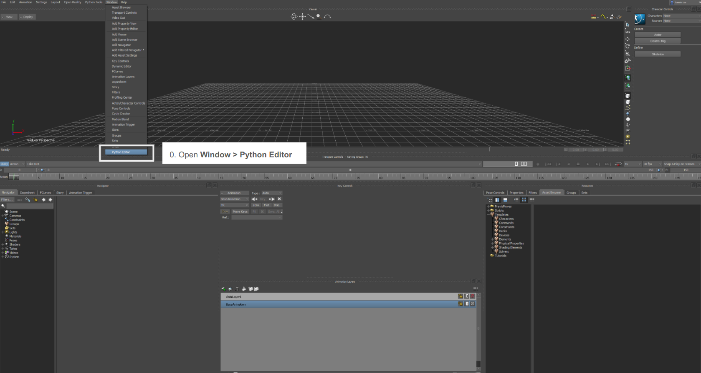
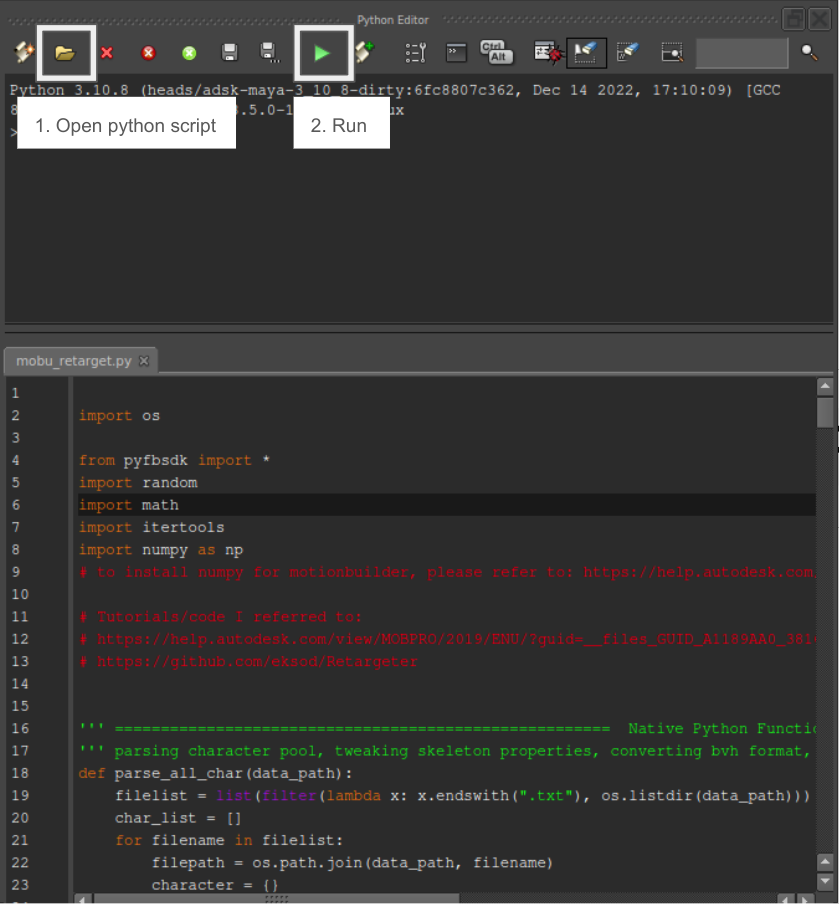

# SAME: Skeleton-Agnostic Motion Embedding for Character Animation

  


Authors' implementation of the paper <strong>SAME: Skeleton-Agnostic Motion Embedding for Character Animation</strong> (SIGGRAPH ASIA 2023 Conference Proceedings). 

<a href ="https://sunny-codes.github.io/projects/same.html"><strong>Project Page</strong></a>
|
<a href ="https://dl.acm.org/doi/10.1145/3610548.3618206"><strong>ACM Library</strong></a>
|
<a href ="https://sunny-codes.github.io/assets/pdf/SAME.pdf"><strong>Paper</strong></a>
|
<a href ="https://www.youtube.com/watch?v=pDPSDe42uho&ab_channel=SunminLee"><strong>Video</strong></a>


<br>

## ⚙️ Installation
- Install freeglut3-dev : ```sudo apt-get install freeglut3-dev```.    
- Set up a virtual environment.
    ```
    cd SAME
    conda create -n same python=3.8
    conda activate same
    ```
- Python dependencies can be installed at once by running the script:
    ```
    bash ./install.sh
    ```
    We checked our code works with Python 3.8, pytorch 2.3.0 and CUDA 11.8. You may modify library versions if needed.  
    The installation script also includes initializing our forked version of <a href="https://github.com/facebookresearch/fairmotion">fairmotion</a>.

## 🚀 Quick Start
### Pretrained Model and Dataset
- We provide a pretrained model `result/ckpt0`. 
- You can download the dataset <a href="https://drive.google.com/file/d/1YhgHENGqQKxXzXZerG3VycfjjNTyFqh1/view?usp=sharing">all at once</a>, or <a href="https://drive.google.com/drive/folders/1UQ0hQEiDq31z8JarJez9d-7aiApNUL5P?usp=drive_link">per individual task</a> if you're interested specifically in certain tasks.

### Run demo
```
=== Viewer Control ===
Mouse
    Left    Rotate
    Right   Pan
    Middle  Zoom
    
Keyboard
    space   play/stop
    [       previous frame
    ]       next frame
    m       next result
```
All commands in this README assume you are running them under the `src` directory.

- SAME Autoencoder:    
    - Quantitative Evaluation: 
        ```
        python same/test.py
        ```
        - Given a source motion (left) and a random target skeleton (middle), retargeted result (right).   
        - Source and target skeleton are masked (some joints of the skeleton are removed) randomly.
    
    - Quantitative Evaluation (Table 1,2): 
        ```
        python task/evaluation/table1.py
        python task/evaluation/table2.py
        ```       


- Downstream Tasks   
    - Arithmetic Operation:
        ```
        python task/arithmetic/main.py 
        ```
        - Given motions `M_b, M_p, M_m` (Left three motions) and a scale `s` which may have different skeletons, we demonstrate arithmetic operation in SAME space `Z_b + s * (Z_p - Z_m)` realized to a random character(Rightmost). Press `[m]` to see next result.

    - Similar Motion Search: 
        ```
        python task/similar_motion_search/main.py
        ```
        - For each motion in Key set, it searches the top 5 closest motion among search database.    
        - The search result and the distance between the key and the searched result is printed and also saved to `search_result.csv`.   

    -  Motion Classification: 
        ```
        python task/classification/main.py
        ```
        - It trains a skeleton-agnostic motion classifier. At each epoch, it prints the test accuracy and fail cases.

    - Motion Matching: 
        ```
        python task/motion_control/main.py   
        ```
        - Motion matching operates in SAME-space according to auto-generated user control input. 
        - To try morphing the character on the fly as in the demo video, add the `--demo skel_change` argument. Character morphing will occur about 16 seconds after starting.   

</br>

## 👾 Train from scratch

This section describes the full process to train and test your own model:

1) Data preprocess: Prepare dataset and create augmented motion pairs
2) Base model : Train a Skeleton-Agnostic Motion Autoencoder
3) Downstream tasks

Let's walk through each step.

### 1. Data preprocess
We provide a <a href="https://drive.google.com/file/d/1vnpn__yqV9ubHHvLpl8Gr5eExdUVyhSB/view?usp=sharing">training dataset</a> we used in the paper. If you want to use this dataset for training your model, you may skip this step, and proceed to Step 2.

If you have your own dataset that you want to use for training, please follow the steps below.   
For a more detailed explanation of the notations and algorithms, please refer to Section 4.3.1 and Appendix Algorithms 1 and 2 of our <a href ="https://sunny-codes.github.io/assets/pdf/SAME.pdf">paper</a>.
#### 1.1 Prepare data
- Skeleton dataset $S$ 
    - Place skeleton T-pose bvhs under `data/[DATA_NAME]/character/bvh/`.
        <details> 
        <summary>Example File Hierarchy</summary> 

        ```python
        data
        └── sample
            └── character
                └── bvh
                    └── s0.bvh
                    └── s1.bvh
                    └── ...
        ```
        </details>
    - Extract character's joint global position at its T-pose.   
    The result is saved under <code>data/[DATA_NAME]/character/joint_pos/</code> as the same filename in `.txt` file extension.
        ```
        python preprocess/skel_list.py --data [DATA_NAME]
        # example) python preprocess/skel_list.py --data sample
        ```
        <details>
        <summary>Example File Hierarchy</summary>

        ```python
        data
        └── sample
            └── character
                └── bvh
                    └── s0.bvh
                    └── s1.bvh
                    └── ...
                └── joint_pos
                    └── s0.txt
                    └── s1.txt
                    └── ...
        ```
        </details>

- Motion dataset $M$ 
    - Place motion bvh files under `data/[DATA_NAME]/motion/bvh/`. It's fine to include a subdirectory.
        <details>
        <summary> Example File Hierarchy </summary>

        ```python
        data
        └── sample
            └── motion
                └── bvh
                    └── m0.bvh
                    └── m1.bvh
                    └── ...
                    └── subdir
                        └── m2.bvh
                        └── m3.bvh
                        └── ...
        ```
        </details>

    - The first frame of motion should be in T-pose with the character facing +Z axis positioned at the origin(0,0) of XZ plane.
    - If the motion is too long, we cut our motions into reasonable length (e.g., 10 seconds) to balance the motion length with other short motion clips. This step is optional.

#### 1.2 Augment data
<!-- You can either augment motion pairs by automated script using MotionBuilder, or  -->
Here we explain how to augment Skeleton dataset $S$ and Motion dataset $M$ into $S'$ and $M'$.   
- install Autodesk MotionBuilder. Autodesk supports education license for students.
- Modify the following settings in `mobu_script/mobu_retarget.py`
    - specify `DATA_DIR`, `DATA_NAME`
    - `batch_size`: retarget motion batch size per each random skeleton ($B$ in algorithm 2.)
    - `iter_num`: number of retargeting iteration ($R$ in algorithm 2.)
    - `merge_skel`: True if not using any skeletal variations
    - `fresh_start`: In case you stopped retargeting script and wish to continue from where you stopped (rather than retargeting all over again), set `fresh_start= False`.    
    Otherwise use True as default.
    - If bvh files contains joint names that are not included in Mobu joint names, add it to `joint_candidates`. Please refer to the code comments for more detail.
    - We removed finger joints from all data. If you want to include finger joints and retarget them, you may modify the `jointList` and `joint_candidates` properly to characterize and retarget fingers as well.
- Start MotionBuilder
- From Window > python editor, open and run the python script (`mobu_script/mobu_retarget.py`).
    <p float="left">
    
    
    </p>

    - The result is generated under `data/[DATA_NAME]/motion/`.
        - `result`: retargeted motions (filenames: 0.bvh, 1.bvh, ...)
        - Additionally, `character.txt`, `fileList.txt`, `pair.txt` file is generated.    
        For the detail of the information each file contains, please refer to `mobu_retarget.py`
        - Caution: Motionbuilder may crash if you try to mainpulate the UI while running the script. It's better to leave it do its job and wait... If it crashed in the middle, we have continue options (`fresh_start=False`) so that you don't have to re-start all over again.
        <details>
        <summary>Example File Hierarchy after augmenting</summary>

        <pre><code>data
        └── sample
            └── motion
                └── bvh
                    └── m0.bvh
                    └── m1.bvh
                    └── ...
                    └── subdir
                        └── m2.bvh
                        └── m3.bvh
                        └── ...
                    └── <strong>result</strong>
                        └── retarget_0.bvh
                        └── retarget_1.bvh
                        └── ...
                └── <strong>character.txt</strong>
                └── <strong>filelist.txt</strong>
                └── <strong>pair.txt </strong></code></pre>
        </details>
        

#### 1.3 Process data
Process a paired motion dataset(.bvh files) to .npz files.
``` 
python preprocess/preprocess_data.py --data [DATA_NAME]

--train     : when processing a training dataset. 
            If you turn on the flag, mean/std statistics of data are computed and saved during training. 
            (For test dataset, turn this off so the statistics won't be computed 
            For inference, values from for training dataset will be used automatically.)
--wopair    : when using a dataset without augmented pairs (i.e., w/o pair.txt)
--append_log: when continuing the process (killed unexpectedly) or when merging multiple dataset
```

<details>
<summary> example result file hierarchy after running <code>python preprocess/preprocess_data.py --data sample --train</code></summary>
<pre>
<code>data
├── sample
│   └── motion
│       └── bvh
│           └── m0.bvh
│           └── m1.bvh
│           └── ...
│           └── subdir
│               └── m2.bvh
│               └── m3.bvh
│               └── ...
│           └── result
│               └── retarget_0.bvh
│               └── retarget_1.bvh
│               └── ...
|           └── pair.txt
│       └── <strong>processed</strong>
│           └── m0.bvh.npz
│           └── m1.bvh.npz
│           └── subdir
│               └── m2.bvh.npz
│               └── m3.bvh.npz
│               └── ...
│           └── result
│               └── retarget_0.bvh.npz
│               └── retarget_1.bvh.npz
│               └── ...``` 
|           └── ms_dict.pt
</code>
</pre>
</details>

---
### 2. Skeleton-Agnostic Motion AutoEncoder
#### 2.1 Train
Create a config file (e.g., `config/mycfg`) and specify `train_data` as the dataset you created from Step 1
```
# train
python same/train.py --config [CFG_NAME] --exp [EXP_NAME]
```
#### 2.2 Test
```
# Make sure you preprocessed test dataset following Step 1.3 as well.

python same/test.py 
--model_epoch   [model_name]: one of the format [EXP_NAME], [EXP_NAME]/[saved_epoch(int)], or [EXP_NAME]/latest
--data_dir      [DATA_NAME] 
--device        cpu or cuda
--rnd_tgt       use random target skeleton (else; select target skeleton from the paired dataset)
--src_mask      randomly mask part of the src skeleton joints (prob=0.5) 
--tgt_mask      randomly mask part of the tgt skeleton joints (prob=0.5) 
```
---
### 3. Downstream Tasks

#### 3.1 Arithmetic operation
Given motions `M_b, M_p, M_m` and a scale `s` which may have different skeletons,   
we demonstrate arithmetic operation in SAME space `Z_b + s * (Z_p - Z_m)` realized to a random character.   
Specify `[data_dir], [m_plus], [m_minus]` of the motion dataset you want to use and `[scale]` properly.
```
python task/arithmetic/main.py 
--model_epoch [model_epoch] 
--device    [cpu or cuda] 
--m_plus    [M_p bvh file path] 
--m_minus   [M_m bvh file path] 
--scale     [scale (float)]
--data_dir  [data directory that contains M_b] 
```
  

#### 3.2 Similar Motion Search
We can find similar motions given `key` and `search database` that consists of different skeletons.   
Top 5 search results and the distance are printed and saved to `search_result.csv`   
```
python task/similar_motion_search/main.py 
--model_epoch   [model_epoch] 
--key_set       [key data directory] 
--search_set    [search database directory]
```

#### 3.4 Classification
To train a Skeleton-Agnostic motion classifier, prepare a labeled motion dataset (`data_dir`).    
At each epoch, test accuracy and fail cases are printed. Trained model is saved under `out`.
```
python task/classification/main.py
--model_epoch   [model_epoch]
--data_dir      [data directory of which a subdirectory('train', 'validate') contains bvh files]
--out           [directory name to save the learned classifier]
```
<details> 
<summary>Example Data File Hierarchy</summary> 

    data
    └── [data_dir]
        └── train
            └── bvh
                └── label0 (e.g., walk)
                    └── motion0.bvh
                    └── ...
                └── label1 (e.g., jump)
                    └── motion1.bvh
                    └── ...
                └── ...
        └── validate
            └── bvh
                └── label0 (e.g., walk)
                    └── testmotion0.bvh
                    └── ...
                └── label1 (e.g., jump)
                    └── testmotion1.bvh
                    └── ...
                └── ...
</details>


#### 3.2 Interactive Character Control (Motion Matching)
For SAME-space motion matching among heterogeneous datasets,   
Collect the motion dataset you want to use and annotate action labels (`data_dir`).     
```
task/motion_control/main.py 
--model_epoch   [model_epoch] 
--data_dir      [data_dir]

*Note: There are also many parameters you can choose for motion matching; 
you may tune according to your own taste or depending on the motion dataset/control logic.
```

<details> 
<summary>Example Data File Hierarchy</summary> 

```
[data_dir]
└── motion
    └── m1.bvh
    └── m2.bvh
    └── ...
└── annotation
    └── m1.lab
    └── m2.lab
    └── ...
```
</details>


</br>

## 🙏 Acknowledgements
This project stands on the shoulders of several open-sourced libraries and prior research. 
- We were inspired by <a href="https://github.com/DeepMotionEditing/deep-motion-editing/">deep-motion-editing</a> in representing skeletal motion as a graph and employing GNN.
- Our code builds upon <a href="https://github.com/facebookresearch/fairmotion">fairmotion</a> which offers motion library and visualization capabilities.
- Our MotionBuilder python scripting is largely based on <a href="https://github.com/eksod/Retargeter"> Retargeter</a>. 
- We adopted spring functions, foot sliding cleanup, trajectory prediction, and some controller logic from <a href="https://github.com/orangeduck/Motion-Matching"> Motion-Matching</a>.

We sincerely thank the authors for sharing their amazing work.   
We hope our open-source efforts can contribute similarly.

</br> 

## 📜 Citation
If you find our work useful, please cite our paper:
```
@article{10.1145/3610548.3618206
    author = {Lee, Sunmin and Kang, Taeho and Park, Jungnam and Lee, Jehee and Won, Jungdam},
    title = {SAME: Skeleton-Agnostic Motion Embedding for Character Animation},
    year = {2023},
    doi = {10.1145/3610548.3618206},
    booktitle = {SIGGRAPH Asia 2023 Conference Papers},
    location = {Sydney, NSW, Australia},
}
```
<br> 

## 💌 Contact
Sunmin Lee sunmin.lee@imo.snu.ac.kr